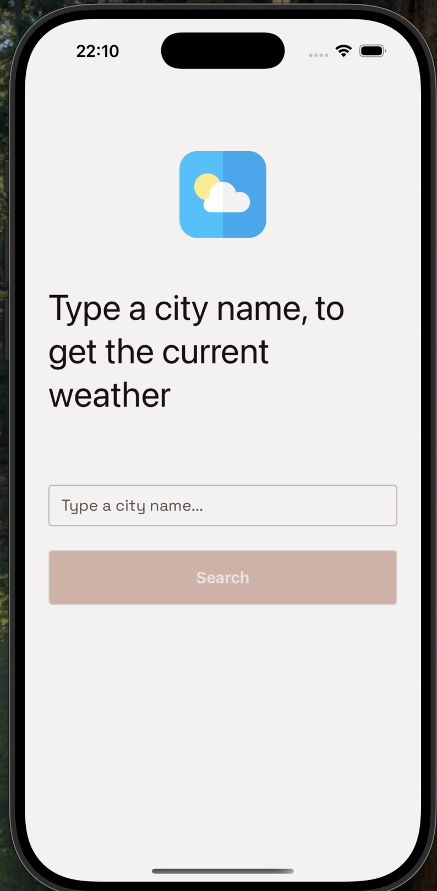
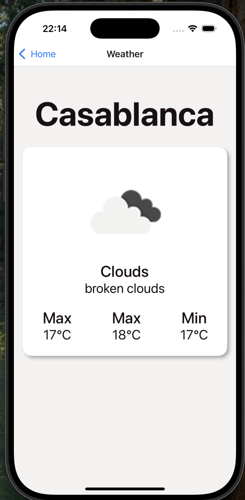

# 🌤️ React Native Weather App

A clean and modern weather app built with **React Native**, using the powerful **[Ignite CLI](https://github.com/infinitered/ignite)** boilerplate by Infinite Red. The app fetches current weather and a forecast by city name using the **OpenWeatherMap API**.

---

## ✨ Features

- 🔍 Search by city name
- 🌤️ Current weather display
- 📦 Bootstrapped with **Ignite CLI**
- 🌐 Uses **Context API** for managing weather and search data
- 💡 Clean architecture & modular folder structure
- 📱 Supports both Android & iOS devices

---

## 📸 Screenshots





## 🚀 Getting Started

### 1. Clone the repository

```bash
git clone https://github.com/your-username/react-native-weather-app.git
cd react-native-weather-app

```

### 2. Install dependencies

```bash
yarn
```

# or

```bash
npm install
```

### 3. Set up your API key

Create a .env file in the root of the project and add your OpenWeatherMap API key. You can get your free API key from https://openweathermap.org/api

```bash
`OPEN_WEATHER_MAP_API_KEY`=your_api_key_here
```

`OPEN_WEATHER_MAP_API_KEY`=your_api_key_here

### 4. Running the app

#### Run on Android

```bash
yarn run android

```

#### Run on iOS

```bash
yarn run ios

```
